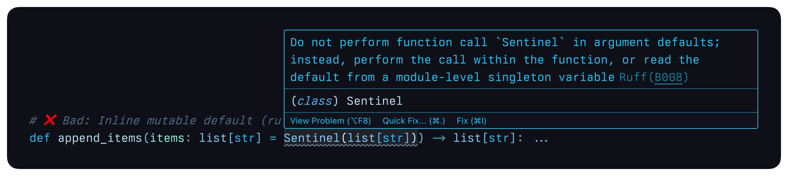
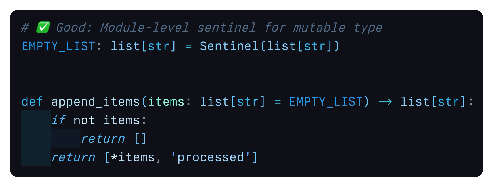

# Best Practices

## Linting and Code Quality

### Avoiding Ruff `B008` Warnings

When using mutable types as defaults, linters like Ruff will warn about mutable default arguments.
`Sentinel`s provide an elegant solution:

#### ❌ Incorrect: Direct Mutable Default



```python
# Triggers Ruff B006: "Do not use mutable data structures for argument defaults."
def append_items(items: list[str] = []) -> list[str]:
    items.append('new_item')
    return items
```

Also problematic: Inline `Sentinel` creation. This is because `Sentinel(list[str])` is seen by the type-checker/linter
exactly the same way as the example above - in-line `[]` or `list()` as the parameter default:

```python
# Triggers Ruff B008: "Do not perform function call `Sentinel` in argument defaults; instead, perform the call within
# the function, or read the default from a module-level singleton variable."
def append_items(items: list[str] = Sentinel(list[str])) -> list[str]:
    if not items:
        return []
    return [*items, 'processed']
```

#### ✅ Correct: Module-Level Sentinel



```python
from typed_sentinels import Sentinel

# Define at module level:
EMPTY_LIST: list[str] = Sentinel(list[str])


def append_items(items: list[str] = EMPTY_LIST) -> list[str]:
    if not items:
        return []
    return [*items, 'processed']


# Note: This is actually fine due the immutability of our tuple here - No complaints! Though, unlesss you have a
# specific reason to do it this way, keep in mind you are going to incur the (likely negligible) overhead of the
# `Sentinel()` call every time your function is invoked. It might add up quick!
def add_to_tuple(items: tuple[str, ...] = Sentinel(tuple[str, ...])) -> tuple[str, ...]:
    if not items:
        return ()
    return (*items, 'processed')


print(append_items())  # -> []
print(append_items(['item1', 'item2', 'item3']))  # -> ['item1', 'item2', 'item3', 'processed']

print(add_to_tuple())  # -> ()
print(add_to_tuple(('item1', 'item2', 'item3')))  # -> ('item1', 'item2', 'item3', 'processed')
```
