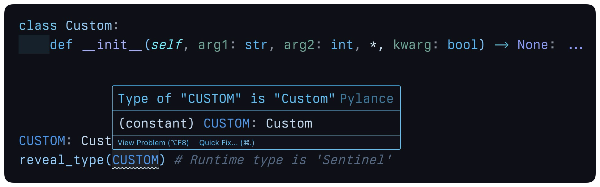

# typed-sentinels

Statically-typed sentinel objects with singleton qualities for Python 3.12+.



## Why typed-sentinels?

`Sentinel` instances provide type-safe placeholder objects that maintain singleton behavior.
They're perfect for default parameter values when `None` isn't appropriate or when you need type safety.

### Key Benefits

- **Type Safety**: `Sentinel` objects appear as their target type to static type checkers.
- **Singleton Behavior**: Only one instance exists per type hint.
- **Thread Safety**: Safe for concurrent access across multiple threads.
- **Immutability**: Cannot be modified after creation.
- **Always Falsy**: Natural `if not value:` patterns.
- **Versatile**: Emulate complex, user-defined types, even those which require parameters on instantiation.

## Installation

```bash
pip install typed-sentinels
```

## Quick Example

```python
from typed_sentinels import Sentinel

# Create a sentinel that appears to be a string to the type checker
UNSET: str = Sentinel(str)


def process_data(value: str = UNSET) -> str:
    # Sentinels are always falsy
    if not value:
        return 'No value provided'
    return f'Processing: {value}'


# Type-safe usage
result = process_data()  # "No value provided"
result = process_data('demo123')  # "Processing: demo123"
```

## Advanced Example

Perfect for types requiring runtime parameters:

```python
from typed_sentinels import Sentinel


class DatabaseConfig:
    def __init__(self, host: str, port: int):
        self.host = host
        self.port = port


# Appears to the type-checker as an instance of `DatabaseConfig`
DEFAULT_CONFIG: DatabaseConfig = Sentinel(DatabaseConfig)


def connect(config: DatabaseConfig = DEFAULT_CONFIG) -> str:
    if config is DEFAULT_CONFIG:
        config = DatabaseConfig('localhost', 5432)
    return f'Connected to {config.host}:{config.port}'
```

## Singleton Behavior

`Sentinel` objects parameterized with the same type `hint` are always the same instance:

```python
S1 = Sentinel(dict[str, Any])
S2 = Sentinel(dict[str, Any])
S3 = Sentinel(dict[str, bytes])

assert S1 is S2  # True - same type, same instance
assert S2 is not S3  # True - different types, different instances
```
